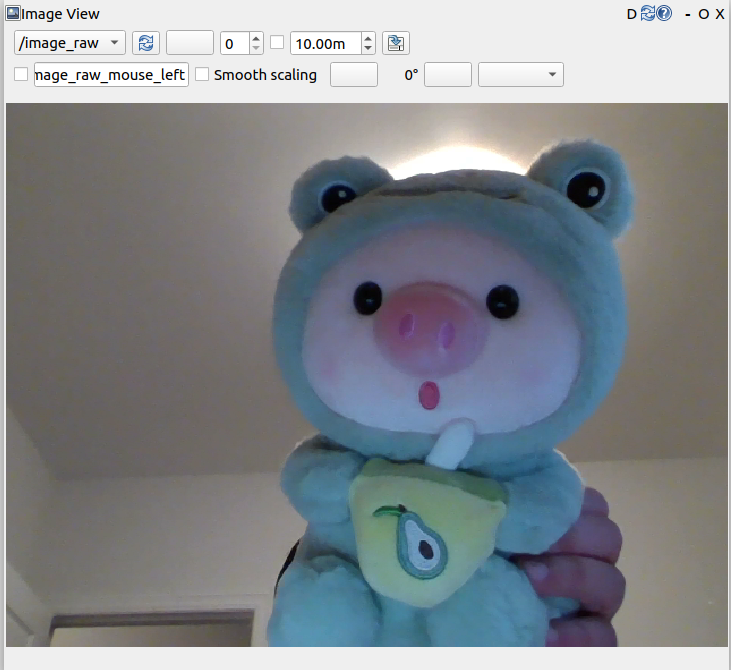

# Assignment

## Introduction

In this assignment, I will present the implementation of avoiding obstacles using an iRobot, specifically, I used tape to create a boundary area, which restricts the robot's movement within a specific area.&#x20;

## Equipment

* Laptop(Ubuntu 22.04)&#x20;
* PC (Ubuntu 22.04)
* Irobot create3
*   Other libraries and software:

    * ROS2 Humble
    * rqt
    * ssh

    ##

    ## High-Level Design Graph

    <figure><figcaption></figcaption></figure>

The Irobot has a relatively small volume and is more suitable for placing a Raspberry Pi on it. The Raspberry Pi is the controller to mainly implements functions such as sensor driving and motor control. However, visual processing and application functions are not suitable for running on the Raspberry Pi due to the low memory, so I put them on another more powerful laptop.

The communication between the two computers seems a bit complicated, after all, there are quite a lot of data transmitted between them. However, the ROS system has already been designed for us, and we only need to configure the ROS environment on each computer. There is no need to make any changes in function development, and the implementation is very convenient.

In addition to the PC I used, I chose a laptop as another computing platform to simulate a Raspberry Pi as a controller placed on the robot.

## Low-Level Design Graph

<figure><figcaption></figcaption></figure>

## Procedure

#### Create workspace

```
$ mkdir -p dev_ws_src/src
$ cd ~/dev_ws/src

# create vision package
$ ros2 pkg create --build-type ament_python vision_topic
```

#### webcam\_pub.py

````
```python
#!/usr/bin/env python3
# -*- coding: utf-8 -*-

import rclpy                        # ROS2 Python interface lib
from rclpy.node import Node         # ROS2 Node class
from sensor_msgs.msg import Image   # image message type
from cv_bridge import CvBridge      # ROS image message to OpenCV image converter
import cv2                          # Opencv lib

"""
ROS2 ImagePublisher class
"""
class ImagePublisher(Node):

    def __init__(self, name):
        super().__init__(name)                                           # ROS Node init
        self.publisher_ = self.create_publisher(Image, 'image_raw', 10)  # create image topic publisher
        self.timer = self.create_timer(0.1, self.timer_callback)         # create timer to publish image topic
        self.cap = cv2.VideoCapture(0)                                   # create video capture object
        self.cv_bridge = CvBridge()                                      # create cv_bridge object

    def timer_callback(self):
        ret, frame = self.cap.read()                                     # read video frame
        
        if ret == True:                                                  # if read video frame successfully
            self.publisher_.publish(
                self.cv_bridge.cv2_to_imgmsg(frame, 'bgr8'))             # publish video frame to topic

        self.get_logger().info('Publishing video frame')                 # print log info

def main(args=None):                                 # main function
    rclpy.init(args=args)                            # ROS2 Python interface init
    node = ImagePublisher("topic_webcam_pub")        # create ROS2 Node object
    rclpy.spin(node)                                 # spin node
    node.destroy_node()                              # destroy node
    rclpy.shutdown()                                 # ROS2 Python interface shutdown

```
````

After completing the code implementation, It is needed to set the compilation options for the package to let the system know the entry point of the Python program. To do this, open the `setup.py` file of the package and add the following configuration for the entry points:

```yaml
entry_points={
        'console_scripts': [
         'webcam_pub  = vision_topic.webcam_pub:main',
        ],
    },
```

Run the `webcam_pub` topic and `rqt` tool to see video frames.

<figure><figcaption><p>Video captured</p></figcaption></figure>

#### webcam\_sub.py

````python
```python
#!/usr/bin/env python3
# -*- coding: utf-8 -*-


import rclpy                            # ROS2 Python library
from rclpy.node import Node             # ROS2 node class
from sensor_msgs.msg import Image       # ROS2 image message
from cv_bridge import CvBridge          # ROS2 OpenCV bridge
import cv2                              # Opencv library
import numpy as np                      # Python library for numerical computation

from cus_interfaces.msg import Collision

lower_red = np.array([0, 90, 128])      # the lower boundary of red color in HSV color space
upper_red = np.array([180, 255, 255])   # the upper boundary of red color in HSV color space


"""
create a class to define a ROS2 node
"""
class ImageSubscriber(Node):
    def __init__(self, name):
        super().__init__(name)                                  # ROS2 parent class initialization
        self.sub = self.create_subscription(
            Image, 'image_raw', self.listener_callback, 10)     # create a subscriber to receive image message
        self.cv_bridge = CvBridge()                             # create a bridge to convert ROS2 image message to OpenCV image

        self.declare_parameter('red_h_upper', 0)                # declare a parameter
        self.declare_parameter('red_h_lower', 0)                # declare a parameter
        
        self.collision_pub = self.create_publisher(Collision, 'collision_warning', 10)

    def edge_detect(self, image):
        upper_red[0] = self.get_parameter('red_h_upper').get_parameter_value().integer_value      # read the upper threshold parameter value
        lower_red[0] = self.get_parameter('red_h_lower').get_parameter_value().integer_value      # read the lower threshold parameter value
        hsv_img = cv2.cvtColor(image, cv2.COLOR_BGR2HSV)        # convert BGR image to HSV image
        mask_red = cv2.inRange(hsv_img, lower_red, upper_red)   # extract the red color region in the HSV image
        contours, hierarchy = cv2.findContours(
            mask_red, cv2.RETR_LIST, cv2.CHAIN_APPROX_NONE)     # find the contours of the red color region

        height, width = image.shape[:2]
        y_coord = int(height * (9/10))
        pt1 = (0, y_coord)
        pt2 = (width, y_coord)
        cv2.line(image, pt1, pt2, (255, 0, 0), 2)             # Draw the line on the image
        for cnt in contours:                                    # traverse all the contours
            if cnt.shape[0] < 150:
                continue

            (x, y, w, h) = cv2.boundingRect(cnt)                # get the bounding rectangle of the contour

            if y + h  >= y_coord:
                self.get_logger().info('Collision Warning')
                collision_msg = Collision()
                collision_msg.warning = True
                self.collision_pub.publish(collision_msg)
            else:
                self.get_logger().info('No Collision')
                collision_msg = Collision()
                collision_msg.warning = False
                self.collision_pub.publish(collision_msg)
            center = (int(x+w/2), int(y+h/2))                   # get the center of the contour
            cv2.drawContours(image, [cnt], -1, (0, 255, 0), 2)  # draw the contour on the image
            cv2.circle(image, center, 5,
                       (0, 255, 0), -1)                         # draw the center of the contour on the image


        cv2.imshow("object", image)                             # show the image
        cv2.waitKey(10)

    def listener_callback(self, data):
        self.get_logger().info('Receiving video frame')         # print the log information
        image = self.cv_bridge.imgmsg_to_cv2(data, 'bgr8')      # convert ROS2 image message to OpenCV image
        self.edge_detect(image)                               # call the edge detection function


def main(args=None):                                        # main function
    rclpy.init(args=args)                                   # initialize ROS2 Python interface
    node = ImageSubscriber("webcam_sub")              # create a node object
    rclpy.spin(node)                                        # spin the node
    node.destroy_node()                                     # destroy the node
    rclpy.shutdown()                                        # shutdown ROS2 Python interface

```
````

Add the entry point

```yaml
entry_points={
        'console_scripts': [
         'webcam_pub = vision_topic.webcam_pub:main',
         'webcam_sub = vision_topic.webcam_sub:main',
        ],
    },
```

By declaring two parameters in the codes, the threshold can be easily adjusted during run time without rebuilding the package using the following commends;

```bash
ros2 set webcam_sub red_h_lower 0
ros2 set webcam_sub red_h_upper 180
```

<figure><figcaption><p>Example of edge detection</p></figcaption></figure>

I then compare the y coordinate of the bottom edge of the bounding rectangle with the y coordinate of a line to check if they touch. If they touch, the node will publish another message to forward the `collision topic`.

#### action.py

```python
import rclpy
from rclpy.node import Node
from cus_interfaces.msg import Collision
from geometry_msgs.msg import Twist


class action(Node):

    def __init__(self, name):
        super().__init__(name)
        self.subscription = self.create_subscription(
            Collision,
            'collision_warning',
            self.listener_callback,
            10)                                                             # create a subscriber
        
        self.vel_publisher = self.create_publisher(Twist, 'cmd_vel', 10)

    def listener_callback(self, msg):
        angle = 0.0     # for turning 
        linear = 0.0    # distance for going straight forward.
        if msg.warning:    # if collision warning is true
            self.get_logger().info('forward collision warning, turn left')
            angle = 0.1         # turn right
        else:
            linear = 0.5        # go straight forward         
    
        twist = Twist() # create a Twist object
        twist.linear.x = linear
        twist.angular.z = angle
        if self.vel_publisher.get_subscription_count() > 0: # publish twist message if there is subscriber
            self.vel_publisher.publish(twist)
        else:
            self.get_logger().info('waiting for subscriber')  # otherwise wait for a subscriber.


def main(args=None):
    rclpy.init(args=args)

    node = action("collision_subscriber")

    rclpy.spin(node)
    node.destroy_node()
    rclpy.shutdown()

```

This node listens for a message of type Collision on the topic collision\_warning. When a message is received, it checks the warning field of the message. If it is True, the node turns the robot slightly to the left, otherwise, it moves the robot forward. The movement commands are published to the topic cmd\_vel.

### Conclusion

n conclusion, this assignment demonstrated the implementation of obstacle avoidance using an iRobot, where a tape boundary was created to restrict the robot's movement within a specific area. The implementation involved creating a ROS2 workspace, designing high and low-level architecture, and developing codes to subscribe to an image topic, perform edge detection, publish a collision topic, and listen to the collision topic to generate movement commands for the robot.&#x20;

