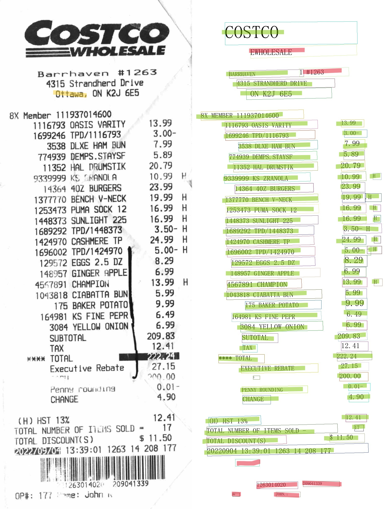
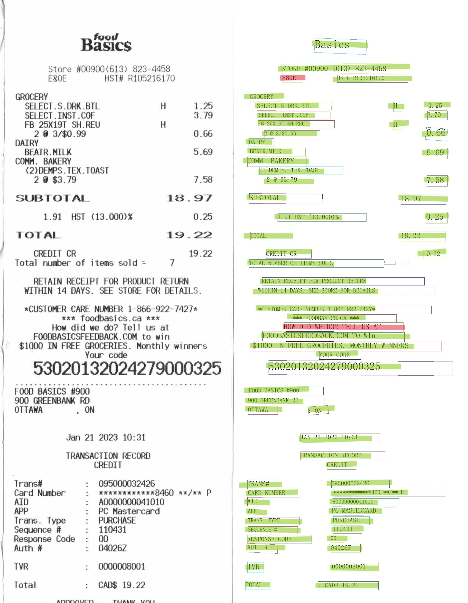

# Accuracy

<table data-view="cards"><thead><tr><th></th><th></th><th></th></tr></thead><tbody><tr><td>Correct</td><td></td><td></td></tr><tr><td>Incorrect</td><td></td><td></td></tr><tr><td>Missing</td><td></td><td></td></tr></tbody></table>



<figure><figcaption></figcaption></figure>



<figure><figcaption></figcaption></figure>



<figure><figcaption></figcaption></figure>

$$
f(x) = x * e^{2 pi i \xi x}
$$



<figure><figcaption></figcaption></figure>



<figure><figcaption></figcaption></figure>



$$
accuracy = avr(sum(correct/(correct+incorrect+missing)))
$$

| receipt | correct | incorrect | missing | accuracy(%) |
| ------- | ------- | --------- | ------- | ----------- |
| 1       | 50      | 5         | 1       | 89.29       |
| 2       | 71      | 7         | 1       | 89.87       |
| 3       | 57      | 7         | 0       | 89.06       |
| 4       | 64      | 4         | 0       | 94.12       |
| 5       | 69      | 7         | 0       | 90.79       |
| Average |         |           |         | 90.63       |

